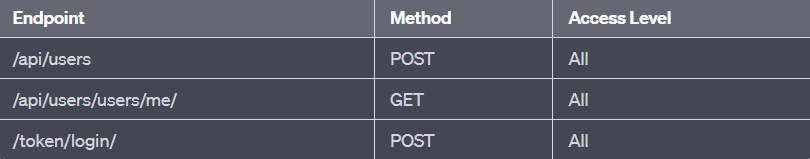

# Django-DRF-RESTfulAPI-Restaurant
Little Restaurant RESTful API example
I used Djoser.

Endpoints:

/api/menu-items  (GET)(For managers , customers and delivery crew)   (POST-PUT-PATCH-DELETE)(403-Unauthorized for customers and delivery crew)
(POST)(201-Created for managers)

/api/menu-items/{menuItem} (GET)(For managers , customers and delivery crew)   (POST-PUT-PATCH-DELETE)(403-Unauthorized for customers and delivery crew)
(POST-PUTH-PATCH-DELETE)(For managers)

/api/groups/manager/users  (GET)(Just for managers)
/api/groups/manager/users (POST)(Just for managers)
/api/groups/manager/users/{userId} (DELETE)(Just for managers)

/api/groups/delivery-crew/users  (GET)(Just for managers)
/api/groups/delivery-crew/users  (POST)(Just for managers)
/api/groups/delivery-crew/users/{userId}  (DELETE)(Just for managers)
